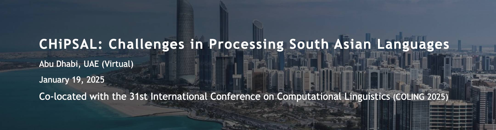

# [NLPineers@ NLU of Devanagari Script Languages 2025: Hate Speech Detection using Ensembling of BERT-based Models](https://arxiv.org/abs/2412.08163)  
[](https://arxiv.org/abs/2412.08163)  

Accepted at [COLING 2025](https://coling2025.org/), part of [CHiPSAL: Challenges in Processing South Asian Languages](https://sites.google.com/view/chipsal/)

---

## Banners

<div style="display: flex; align-items: center; justify-content: center;">
    
    
</div>


This repository hosts the code for the project titled **"Hate Speech Detection using Ensembling of BERT-based Models"** for Devanagari script languages (Hindi, Nepali). The aim is to leverage state-of-the-art techniques like BERT for hate speech detection in South Asian languages.

## About the Project

This project focuses on developing an ensemble-based model for hate speech detection using BERT-based architectures, specifically tailored for languages that use the Devanagari script, such as Hindi and Nepali. The goal is to improve the detection of hate speech and offensive content in social media posts, comments, and other online platforms in these languages.


## Scripts for:


- **Data Augmentation:** Augmentation techniques are applied to both Hindi and Nepali dataset to address class imbalance and enhance model performance.
- **Multiple Models:** The repository includes different models (referred to as m1, m2, m3, etc.) to handle various configurations and techniques. Please refer to the papers table for detailed descriptions of each model.

---

## Setup

1. **Install Dependencies:**

   ```bash
   pip install -r requirements.txt
    ```
2. **Dataset Configuration:**

Change the dataset location as per your setup. Ensure that the dataset path is correctly configured in the script files.

3. **Running the Models:**
    ```
    cd models
    ```
    ```
    python m1_chipsal.py
    ```

## For citation

Will release later,
```
```
---
## Contact

For any queries, feel free to reach out via email 📧:  
- [contact@anmolguragain.com.np](mailto:contact@anmolguragain.com.np)  
- [nadikapoudel16@gmail.com](mailto:nadikapoudel16@gmail.com)
